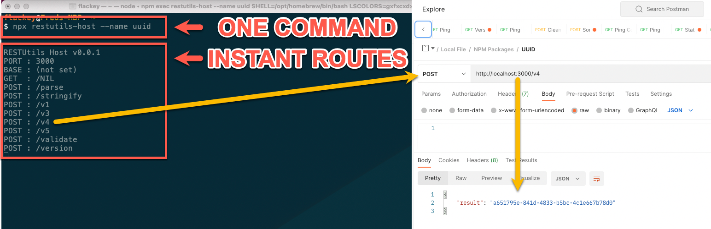
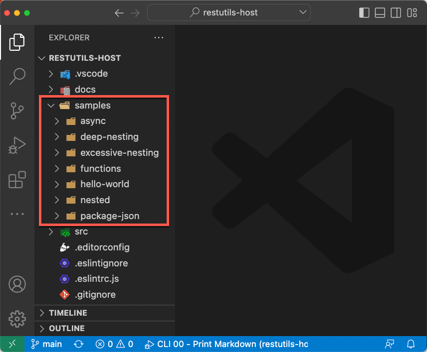
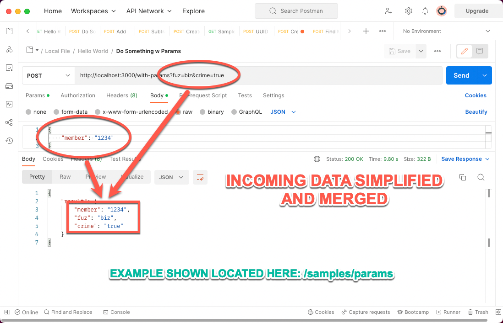
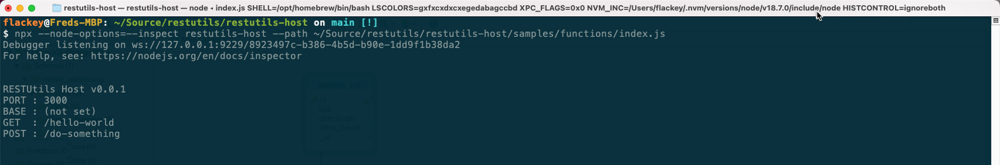
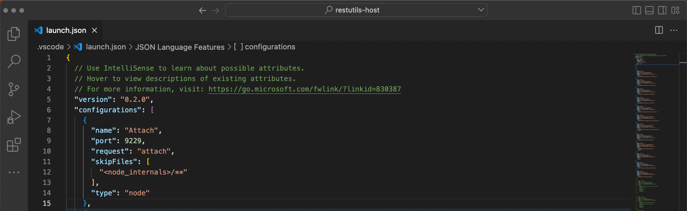

# RESTUtils Host (`restutils-host`)

Instantly convert any JavaScript library into a web-based API!

## Purpose  

Async?  Sync?  Await?  Callbacks?  Nonsense!

Quickly convert any basic JavaScript library into a web-based API by issuing one command.  You don't even need to install it!  This lil' uitlity will pull down and pull in your project, stick a web server in front of it, and setup routes for every property or function within it.



## Simplified Samples


The initial idea of this package was to eliminate all of the boilerplate code needed to stand up APIs when prototyping microservices.  Continuously building the same route files and middleware just doesn't make sense.  With this technique you can focus on carving out the business logic without worrying about how it will be hosted once you're done.  Check out the includes samples to see just how simple your code can be.

## Disclaimer  

This initial version has never seen the light of day.  It's been written by [one guy](https://www.fredlackey.com).  And, is still being tested, expanded, developed, etc., etc., etc.  So, try it out and beat the snot out of it before you use it anywhere.  If you run into any quesitons, send an [email](mailto:fred.lackey@gmail.com) or [open an issue on GitHub](https://github.com/restutils/restutils-host/issues)

## Coding Requirement (Singular)

Yeah, yeah, yeah.  So, what's the catch?  Right?  Well, there is one small rule:

**`Rule #1`**  
Each method in your class must receive one single property and return an object, string, or other primative.  Each function in your library will be wrapped with a `POST` operation where the entire `request.body` object will be sent inside.  All properties in your library become `GET` operations.

**`Rule #2`**  
There isn't a second rule... just that one above.

## Simplified Data Handling

Remember Rule #1 from above?  How the body of each request is passed in to your functions as a single parameter?  Well, this includes querystring parameters.  All data received by your function is combined into this single object parameter for simplicity.  This means your calling application can send in both a JSON object as well as querstring parameters and you don't have to parse them separately.



## Installation

It's best to run from `npx` but it can be installed globally...

```bash
npm i -g restutils-host
```

## Usage  

Launching can be as simple as ... 

```bash
npx restutils-host --name "my-utility"
```

... or, if your project is in a Git repo, just point it there ... 

```bash
npx restutils-host --repo "https://github.com/codergod/my-utility.git"
```

You can even use the worlds simplest JavaScript file...

```bash
npx restutils-host --path "~/my-utility.js"
```

## Parameters

| Name      | Description                    | Type            | Default |
|-----------|--------------------------------|-----------------|---------|
| `name`    | Package name in npmjs.org      | `string`        |         |
| `path`    | Full path to local package     | `string (path)` |         |
| `env`     | Full path to environment file  | `string (path)` |         |
| `repo`    | URL to hosted Git repo         | `string`        |         |
| `depth`   | Maximum levels to recurse      | `number`        |         |
| `base`    | Base path of listener          | `string`        |         |
| `cors`    | Enable CORS                    | `boolean`       | `true`  |
| `port`    | Port for incoming requests     | `number`        | `3000`  |
| `install` | Install dependencies if needed | `boolean`       | `true`  |

## Debugging

Nothing changes while debugging your libraries.  Passing the `--node-options` switch to `npx` causes the Node Debugger to listen as it normally would:



  So, that command above would become...

```bash
npx --node-options=--inspect restutils-host --path "~/my-utility.js"
```

Then just tell your IDE to attach to the process.  In VSCode this is done by creating a debug configuration: 



## Contact

Please feel free to contact me directly with any questions, comments, or enhancement requests:

**Fred Lackey**  
**[fred.lackey@gmail.com](mailto://fred.lackey@gmail.com)**  
**[http://fredlackey.com](http://www.fredlackey.com)**  
